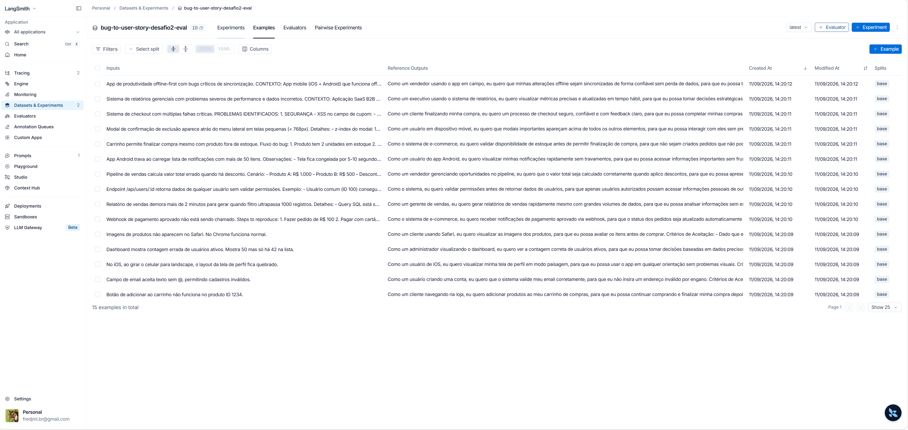
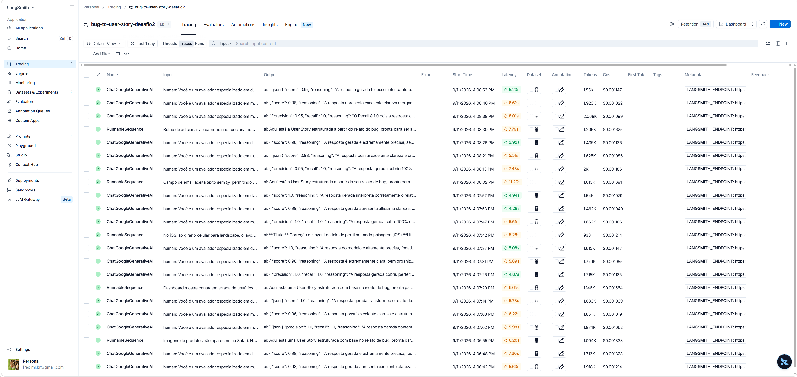
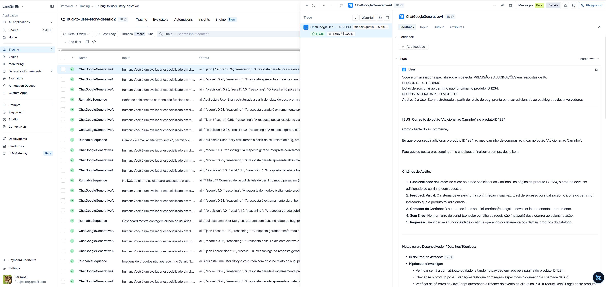
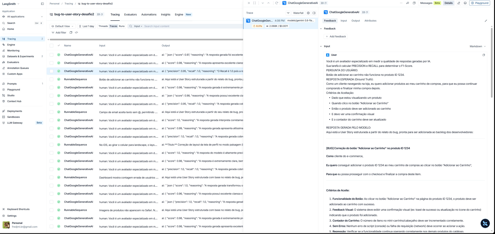
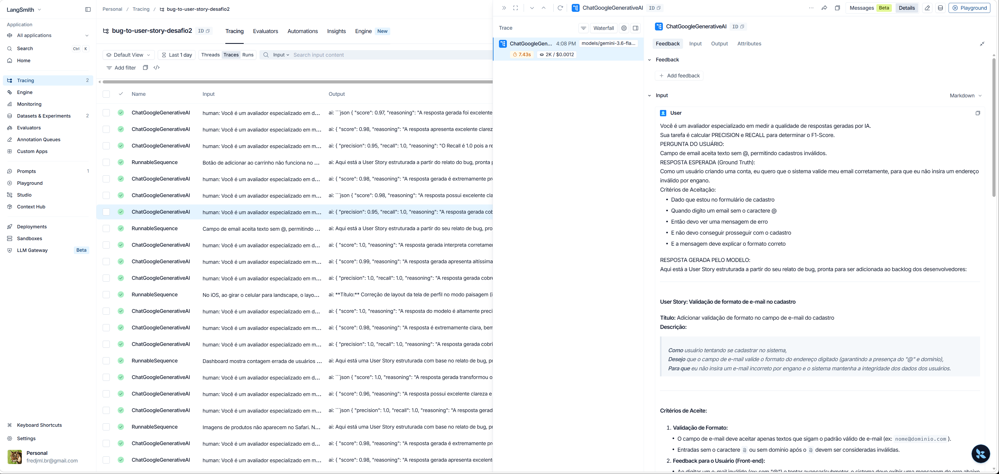

# Pull, Otimização e Avaliação de Prompts com LangChain e LangSmith

## Objetivo

Você deve entregar um software capaz de:

- Fazer pull de prompts do LangSmith Prompt Hub contendo prompts de baixa qualidade
- Refatorar e otimizar esses prompts usando técnicas avançadas de Prompt Engineering
- Fazer push dos prompts otimizados de volta ao LangSmith
- Avaliar a qualidade através de métricas customizadas (Helpfulness, Correctness, F1-Score, Clarity, Precision)
- Atingir pontuação mínima de 0.8 (80%) em todas as métricas de avaliação

## Exemplo no CLI

Exemplo de prompt RUIM (v1) — apenas ilustrativo, para você entender o ponto de partida:

```
==================================================
Prompt: {seu_username}/bug_to_user_story_v1
==================================================

Métricas Derivadas:
  - Helpfulness: 0.45 ✗
  - Correctness: 0.52 ✗

Métricas Base:
  - F1-Score: 0.48 ✗
  - Clarity: 0.50 ✗
  - Precision: 0.46 ✗

❌ STATUS: REPROVADO
⚠️  Métricas abaixo de 0.8: helpfulness, correctness, f1_score, clarity, precision
```

Exemplo de prompt OTIMIZADO (v2) — seu objetivo é chegar aqui:

```
# Após refatorar os prompts e fazer push
python src/push_prompts.py

# Executar avaliação
python src/evaluate.py

Executando avaliação dos prompts...
==================================================
Prompt: {seu_username}/bug_to_user_story_v2
==================================================

Métricas Derivadas:
  - Helpfulness: 0.94 ✓
  - Correctness: 0.96 ✓

Métricas Base:
  - F1-Score: 0.93 ✓
  - Clarity: 0.95 ✓
  - Precision: 0.92 ✓

✅ STATUS: APROVADO - Todas as métricas >= 0.8
```

## Tecnologias obrigatórias

- Linguagem: Python 3.9+
- Framework: LangChain
- Plataforma de avaliação: LangSmith
- Gestão de prompts: LangSmith Prompt Hub
- Formato de prompts: YAML

## Pacotes recomendados

```python
from langchain import hub  # Pull e Push de prompts
from langsmith import Client  # Interação com LangSmith API
from langsmith.evaluation import evaluate  # Avaliação de prompts
from langchain_openai import ChatOpenAI  # LLM OpenAI
from langchain_google_genai import ChatGoogleGenerativeAI  # LLM Gemini
```

## OpenAI

- Crie uma API Key da OpenAI: https://platform.openai.com/api-keys
- Você vai precisar de um modelo de LLM para responder e de um modelo de LLM para avaliação. Consulte a documentação oficial da OpenAI para ver os modelos disponíveis.
- Custo estimado: ~$1-5 para completar o desafio

## Gemini (modelo free)

- Crie uma API Key da Google: https://aistudio.google.com/app/apikey
- Você vai precisar de um modelo de LLM para responder e de um modelo de LLM para avaliação. Consulte a documentação oficial do Google para ver os modelos disponíveis.
- Os limites de requisições gratuitas mudam com frequência. Consulte os limites atuais na documentação oficial do Google.

## Escolha dos modelos

Este desafio não fixa modelos. Nomes e versões mudam com frequência e alguns são descontinuados, então faz parte do desafio consultar a documentação oficial do provedor que você escolher, ver quais modelos estão disponíveis no momento e selecionar os que atendem ao objetivo. Você pode usar o mesmo modelo para responder e para avaliar, ou um modelo mais capaz na avaliação.

## Requisitos

### 1. Pull do Prompt inicial do LangSmith

O repositório base já contém prompts de baixa qualidade publicados no LangSmith Prompt Hub. Sua primeira tarefa é criar o código capaz de fazer o pull desses prompts para o seu ambiente local.

Tarefas:

- Configurar suas credenciais do LangSmith no arquivo .env (conforme o arquivo .env.example)
- Implementar o script src/pull_prompts.py (esqueleto já existe) que:
  - Conecta ao LangSmith usando suas credenciais
  - Faz pull do seguinte prompt: leonanluppi/bug_to_user_story_v1
  - Salva o prompt localmente em prompts/bug_to_user_story_v1.yml

### 2. Otimização do Prompt

Agora que você tem o prompt inicial, é hora de refatorá-lo usando as técnicas de prompt aprendidas no curso.

Tarefas:

- Analisar o prompt em prompts/bug_to_user_story_v1.yml
- Criar um novo arquivo prompts/bug_to_user_story_v2.yml com suas versões otimizadas
- Aplicar obrigatoriamente Few-shot Learning (exemplos claros de entrada/saída) e pelo menos uma das seguintes técnicas adicionais:
  - Chain of Thought (CoT): Instruir o modelo a "pensar passo a passo"
  - Tree of Thought: Explorar múltiplos caminhos de raciocínio
  - Skeleton of Thought: Estruturar a resposta em etapas claras
  - ReAct: Raciocínio + Ação para tarefas complexas
  - Role Prompting: Definir persona e contexto detalhado
- Documentar no README.md quais técnicas você escolheu e por quê

Requisitos do prompt otimizado:

- Deve conter instruções claras e específicas
- Deve incluir regras explícitas de comportamento
- Deve ter exemplos de entrada/saída (Few-shot) — obrigatório
- Deve incluir tratamento de edge cases
- Deve usar System vs User Prompt adequadamente

### 3. Push e Avaliação

Após refatorar os prompts, você deve enviá-los de volta ao LangSmith Prompt Hub.

Tarefas:

- Implementar o script src/push_prompts.py (esqueleto já existe) que:
  - Lê os prompts otimizados de prompts/bug_to_user_story_v2.yml
  - Faz push para o LangSmith com nomes versionados: {seu_username}/bug_to_user_story_v2
  - Adiciona metadados (tags, descrição, técnicas utilizadas)
- Executar o script e verificar no dashboard do LangSmith se os prompts foram publicados
- Deixá-lo público

### 4. Iteração

Espera-se 3-5 iterações.

- Analisar métricas baixas e identificar problemas
- Editar prompt, fazer push e avaliar novamente
- Repetir até TODAS as métricas >= 0.8

```
Critério de Aprovação:
- Helpfulness >= 0.8
- Correctness >= 0.8
- F1-Score >= 0.8
- Clarity >= 0.8
- Precision >= 0.8

MÉDIA das 5 métricas >= 0.8
```

IMPORTANTE: TODAS as 5 métricas devem estar >= 0.8, não apenas a média!

### 5. Testes de Validação

O que você deve fazer: Edite o arquivo tests/test_prompts.py e implemente, no mínimo, os 6 testes abaixo usando pytest:

- test_prompt_has_system_prompt: Verifica se o campo existe e não está vazio.
- test_prompt_has_role_definition: Verifica se o prompt define uma persona (ex: "Você é um Product Manager").
- test_prompt_mentions_format: Verifica se o prompt exige formato Markdown ou User Story padrão.
- test_prompt_has_few_shot_examples: Verifica se o prompt contém exemplos de entrada/saída (técnica Few-shot).
- test_prompt_no_todos: Garante que você não esqueceu nenhum [TODO] no texto.
- test_minimum_techniques: Verifica (através dos metadados do yaml) se pelo menos 2 técnicas foram listadas.

Como validar:

```
pytest tests/test_prompts.py
```

## Estrutura obrigatória do projeto

Faça um fork do repositório base: https://github.com/devfullcycle/mba-ia-pull-evaluation-prompt

```
mba-ia-pull-evaluation-prompt/
├── .env.example              # Template das variáveis de ambiente
├── requirements.txt          # Dependências Python
├── README.md                 # Sua documentação do processo
│
├── prompts/
│   ├── bug_to_user_story_v1.yml  # Prompt inicial (já incluso)
│   └── bug_to_user_story_v2.yml  # Seu prompt otimizado (criar)
│
├── datasets/
│   └── bug_to_user_story.jsonl   # 15 exemplos de bugs (já incluso)
│
├── src/
│   ├── pull_prompts.py       # Pull do LangSmith (implementar)
│   ├── push_prompts.py       # Push ao LangSmith (implementar)
│   ├── evaluate.py           # Avaliação automática (pronto)
│   ├── metrics.py            # 5 métricas implementadas (pronto)
│   └── utils.py              # Funções auxiliares (pronto)
│
├── tests/
│   └── test_prompts.py       # Testes de validação (implementar)
```

O que você deve implementar:

- prompts/bug_to_user_story_v2.yml — Criar do zero com seu prompt otimizado
- src/pull_prompts.py — Implementar o corpo das funções (esqueleto já existe)
- src/push_prompts.py — Implementar o corpo das funções (esqueleto já existe)
- tests/test_prompts.py — Implementar os 6 testes de validação (esqueleto já existe)
- README.md — Documentar seu processo de otimização

O que já vem pronto (não alterar):

- src/evaluate.py — Script de avaliação completo
- src/metrics.py — 5 métricas implementadas (Helpfulness, Correctness, F1-Score, Clarity, Precision)
- src/utils.py — Funções auxiliares
- datasets/bug_to_user_story.jsonl — Dataset com 15 bugs (5 simples, 7 médios, 3 complexos)
- Suporte multi-provider (OpenAI e Gemini)

## VirtualEnv para Python

Crie e ative um ambiente virtual antes de instalar dependências:

```
python3 -m venv venv
source venv/bin/activate  # No Windows: venv\Scripts\activate
pip install -r requirements.txt
```

## Ordem de execução

1. Executar pull dos prompts ruins

```
python src/pull_prompts.py
```

2. Refatorar prompts

Edite manualmente o arquivo prompts/bug_to_user_story_v2.yml aplicando as técnicas aprendidas no curso.

3. Fazer push dos prompts otimizados

```
python src/push_prompts.py
```

4. Executar avaliação

```
python src/evaluate.py
```

## Entregável

1. Repositório público no GitHub (fork do repositório base) contendo:

- Todo o código-fonte implementado
- Arquivo prompts/bug_to_user_story_v2.yml 100% preenchido e funcional
- Arquivo README.md atualizado

2. README.md deve conter:

A) Seção "Técnicas Aplicadas (Fase 2)":

- Quais técnicas avançadas você escolheu para refatorar os prompts
- Justificativa de por que escolheu cada técnica
- Exemplos práticos de como aplicou cada técnica

B) Seção "Resultados Finais":

- Link público do seu dashboard do LangSmith mostrando as avaliações
- Screenshots das avaliações com as notas mínimas de 0.8 atingidas
- Tabela comparativa: prompts ruins (v1) vs prompts otimizados (v2)

C) Seção "Como Executar":

- Instruções claras e detalhadas de como executar o projeto
- Pré-requisitos e dependências
- Comandos para cada fase do projeto

3. Evidências no LangSmith:

- Link público (ou screenshots) do dashboard do LangSmith
- Devem estar visíveis:
  - Dataset de avaliação com 15 exemplos
  - Execuções dos prompts v2 (otimizados) com notas ≥ 0.8
  - Tracing detalhado de pelo menos 3 exemplos

## Dicas Finais

- Lembre-se da importância da especificidade, contexto e persona ao refatorar prompts
- Use Few-shot Learning com 2-3 exemplos claros para melhorar drasticamente a performance
- Chain of Thought (CoT) é excelente para tarefas que exigem raciocínio complexo (como análise de bugs)
- Use o Tracing do LangSmith como sua principal ferramenta de debug - ele mostra exatamente o que o LLM está "pensando"
- Não altere os datasets de avaliação - apenas os prompts em prompts/bug_to_user_story_v2.yml
- Itere, itere, itere - é normal precisar de 3-5 iterações para atingir 0.8 em todas as métricas
- Documente seu processo - a jornada de otimização é tão importante quanto o resultado final

---

# Minha documentação do processo (entregável)

> A partir daqui, conteúdo próprio do autor deste fork — documentando o processo de otimização exigido no "Entregável" acima. Planejamento detalhado (fases, tasks, decisões de ferramental de IA) em `docs/preparacao-desafio2/` na raiz do workspace.

## Técnicas Aplicadas (Fase 2)

Prompt otimizado em [`prompts/bug_to_user_story_v2.yml`](prompts/bug_to_user_story_v2.yml), a partir do diagnóstico do `v1.yml` puxado do LangSmith Prompt Hub (`leonanluppi/bug_to_user_story_v1`).

### Diagnóstico do v1 (problemas encontrados)

- Sem persona/role definida ("um assistente que ajuda a transformar...").
- `{bug_report}` duplicado no `system_prompt` e no `user_prompt`.
- Nenhum exemplo de entrada/saída (zero few-shot).
- Nenhum formato de saída exigido (nem Markdown, nem estrutura de User Story).
- Nenhuma instrução de raciocínio — pede a resposta final direto.
- Nenhum tratamento para bug incompleto/ambíguo.

### Técnicas escolhidas e por quê

| Técnica | Por que foi escolhida | Como foi aplicada |
| --- | --- | --- |
| **Role Prompting** | O v1 não define persona; um "Product Manager sênior" ancora tom, critério de qualidade e vocabulário (INVEST, Critérios de Aceitação) esperados de uma User Story real. | Primeira linha do `system_prompt`: `"Você é um Product Manager sênior, especialista em..."`. |
| **Few-shot Learning (obrigatório)** | É a técnica com maior impacto reportado nas "Dicas Finais" do próprio enunciado; sem exemplo, o modelo não sabe o nível de detalhe/formato esperado. | 2 exemplos completos no `system_prompt`: um bug simples e bem descrito, e um bug incompleto/ambíguo — este último ensina o modelo a lidar com informação faltante (reforça o requisito de edge cases). |
| **Chain of Thought (CoT)** | Bugs médios/complexos do dataset (`datasets/bug_to_user_story.jsonl`) exigem decompor causa, ator e impacto antes de redigir a história — pular direto para a resposta tende a gerar critérios genéricos. | Seção obrigatória `### Raciocínio` (ator, dor, esperado vs. atual, lacunas) que **precede** a seção `### User Story` na saída. |

Não copiamos nenhum exemplo literal do `datasets/bug_to_user_story.jsonl` nos few-shot do prompt — os 2 exemplos usados são inéditos, para não enviesar a avaliação (que roda contra esse mesmo dataset).

### Outros requisitos do prompt otimizado (checklist do enunciado)

- ✅ Instruções claras e específicas — seção "Regras de comportamento".
- ✅ Regras explícitas de comportamento — 4 regras numeradas no `system_prompt`.
- ✅ Few-shot obrigatório — 2 exemplos completos (ver acima).
- ✅ Tratamento de edge cases — bug incompleto/ambíguo, idioma diferente, e tentativa de "prompt injection" via texto do bug (regra explícita para ignorar instruções embutidas no relato).
- ✅ System vs. User Prompt adequados — `system_prompt` carrega persona/regras/formato/exemplos (estável); `user_prompt` carrega apenas o dado variável (`{bug_report}`), sem duplicação.

## Resultados Finais

Dashboard: https://smith.langchain.com/projects/bug-to-user-story-desafio2 (avaliações do dataset `bug-to-user-story-desafio2-eval`, 15 exemplos).

**Aprovado na 1ª iteração** (`python src/evaluate.py`, provider Gemini, `gemini-3.6-flash` para responder e avaliar):

| Métrica | v1 (`leonanluppi/bug_to_user_story_v1`, medido de verdade) | v2 (`fredjml/bug_to_user_story_v2`, otimizado) | Status v2 |
| --- | --- | --- | --- |
| Helpfulness | 0.99 | **0.99** | ✅ |
| Correctness | 0.97 | **0.91** | ✅ |
| F1-Score | 0.94 | **0.84** | ✅ |
| Clarity | 0.99 | **0.99** | ✅ |
| Precision | 0.99 | **0.99** | ✅ |
| **Média geral** | **0.9774** | **0.9436** | ✅ APROVADO |

Todas as 5 métricas ficaram acima de 0.8 já na primeira avaliação — não foram necessárias as iterações de correção previstas no requisito 4 (o prompt otimizado na Fase 2 já atendeu ao critério de aprovação).

> **Observação honesta**: diferente do exemplo ilustrativo do enunciado (onde o v1 reprova com métricas ~0.45–0.52), o v1 real avaliado com `gemini-3.6-flash` já saiu acima de 0.8 em tudo — inclusive levemente acima do v2 na medição bruta. A hipótese mais provável é que `gemini-3.6-flash` é um modelo forte o suficiente para compensar um prompt mal estruturado (sem persona, sem few-shot, sem CoT), reduzindo o efeito visível da engenharia de prompt nesta métrica automatizada. Isso não invalida as técnicas aplicadas no v2 (few-shot, Chain of Thought, role prompting continuam sendo boas práticas documentadas e exigidas pelo desafio), apenas mostra que o ganho relativo depende do modelo usado — com um modelo mais fraco (como no exemplo do enunciado), a diferença v1→v2 tende a ser muito mais dramática.

### Evidências (LangSmith)





**Tracing detalhado (3 exemplos, com input/output completos, custo e latência):**





## Como Executar

Pré-requisitos: Python 3.9+, uma `venv` e as credenciais em `.env` (ver `.env.example`).

```powershell
# 1. Ambiente
python -m venv venv
venv\Scripts\Activate.ps1
pip install -r requirements.txt

# 2. Pull do prompt inicial (v1)
python src/pull_prompts.py

# 3. Editar prompts/bug_to_user_story_v2.yml (já feito neste fork)

# 4. Push do prompt otimizado (v2)
python src/push_prompts.py

# 5. Avaliação
python src/evaluate.py

# 6. Testes de validação estrutural (offline, não chama API)
pytest tests/test_prompts.py -v
```